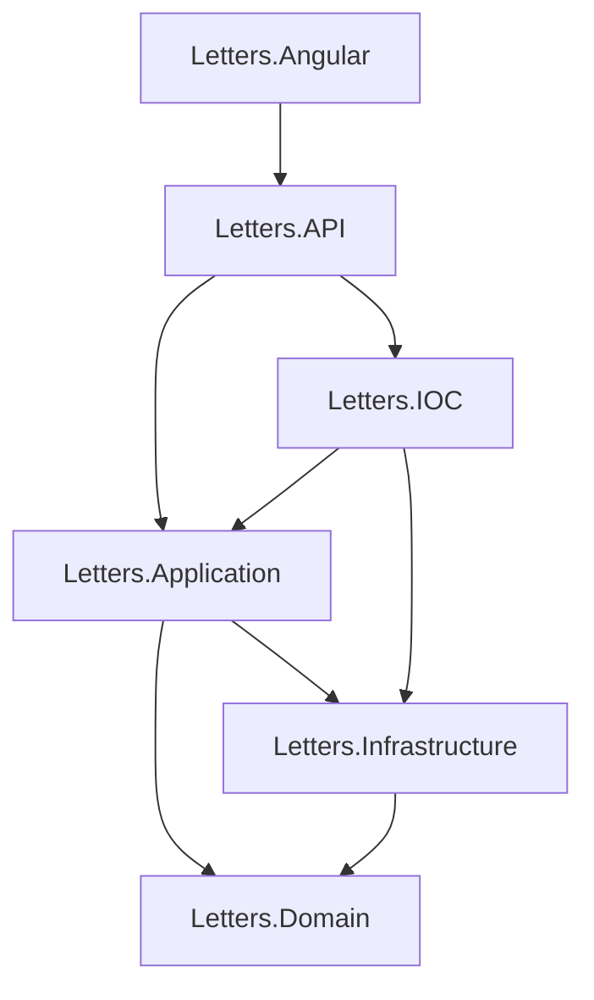

# 📝 Letters - Plataforma de Correção de Redações com IA

<div align="center">


*Plataforma inteligente de correção de redações utilizando Azure OpenAI*

[Demo](https://seu-app.azurewebsites.net) · [Reportar Bug](https://github.com/Andre-Quintela/Letters/issues) · [Solicitar Feature](https://github.com/Andre-Quintela/Letters/issues)

</div>

## 🎯 Sobre o Projeto

**Letters** é uma aplicação web full-stack que revoluciona o processo de correção de redações através de Inteligência Artificial. Utilizando o Azure OpenAI, a plataforma oferece correções detalhadas, feedback personalizado e avaliação automatizada seguindo critérios estabelecidos.

### ✨ Características Principais

- 🤖 **Correção com IA** - Integração com Azure OpenAI (GPT-4) para correções inteligentes e detalhadas
- 📊 **Dashboard Completo** - Visualização de estatísticas, histórico de redações e progresso
- 👥 **Gestão de Usuários** - Sistema de autenticação com perfis de estudantes e professores
- 📝 **Editor de Redações** - Interface intuitiva para submissão e visualização de redações
- 🗂️ **Histórico** - Consulta de redações anteriores com filtros e busca avançada
- 👤 **Perfil de Usuário** - Gerenciamento de dados pessoais e alteração de senha
- 🏗️ **Clean Architecture** - Código organizado e manutenível seguindo boas práticas
- 🌐 **API RESTful** - Backend em .NET 8 com endpoints bem estruturados
- 🎨 **UI/UX Moderna** - Interface responsiva com PrimeNG e Bootstrap Icons
- 🗄️ **Azure SQL Database** - Persistência segura de dados na nuvem
- ☁️ **Deploy no Azure** - Pronto para produção em Azure App Service

## 🏛️ Arquitetura

O projeto segue os princípios de **Clean Architecture** e está organizado em camadas:

```
📁 Letters/
├── 🌐 Letters.API/              # Camada de apresentação (Web API)
├── 🖥️ Letters.Angular/          # Frontend Angular
├── 🎯 Letters.Application/      # Casos de uso e services
├── 🏗️ Letters.Domain/           # Entidades e regras de negócio
├── 🔧 Letters.Infrastructure/   # Acesso a dados e repositórios
└── 🔗 Letters.IOC/              # Injeção de dependência
```

### 📊 Diagrama de Camadas



## 🚀 Tecnologias Utilizadas

### Backend
- **.NET 8.0** - Framework principal
- **ASP.NET Core Web API** - Criação de APIs RESTful
- **Azure OpenAI** - Correção inteligente de redações com GPT-4
- **Entity Framework Core 8.0** - ORM para acesso a dados
- **Azure SQL Database** - Banco de dados relacional na nuvem
- **Azure.Identity** - Autenticação e autorização Azure
- **Clean Architecture** - Separação de responsabilidades em camadas

### Frontend
- **Angular 18** - Framework SPA moderno
- **TypeScript** - Type-safe JavaScript
- **PrimeNG 18** - Biblioteca de componentes UI
- **Bootstrap Icons** - Ícones vetoriais
- **RxJS** - Programação reativa
- **Reactive Forms** - Formulários com validação

### DevOps & Deploy
- **Azure App Service** - Hospedagem na nuvem
- **GitHub Actions** - CI/CD (opcional)
- **PowerShell** - Scripts de build e deploy
- **Azure CLI** - Gerenciamento de recursos Azure

## 📋 Pré-requisitos

### Desenvolvimento Local
- [.NET 8.0 SDK](https://dotnet.microsoft.com/download/dotnet/8.0)
- [Node.js 18+](https://nodejs.org/) e npm
- [Angular CLI 18](https://angular.io/cli) - `npm install -g @angular/cli`
- [Visual Studio 2022](https://visualstudio.microsoft.com/) ou [VS Code](https://code.visualstudio.com/)
- [Azure CLI](https://docs.microsoft.com/cli/azure/install-azure-cli) (para deploy)

### Serviços Azure Necessários
- **Azure SQL Database** - Para persistência de dados
- **Azure OpenAI Service** - Para correção com IA
- **Azure App Service** (Windows) - Para hospedagem (opcional)

## ⚙️ Configuração e Instalação

### 1. Clone o Repositório
```bash
git clone https://github.com/Andre-Quintela/Letters.git
cd Letters
```

### 2. Configuração do Backend

#### Restaurar Pacotes NuGet
```bash
dotnet restore
```

#### Configurar Secrets (Desenvolvimento Local)
Crie o arquivo `Letters.API/appsettings.Local.json`:
```json
{
  "ConnectionStrings": {
    "AZURE_SQL_CONNECTIONSTRING": "sua-connection-string-aqui"
  },
  "AzureOpenAI": {
    "Endpoint": "https://seu-recurso.openai.azure.com/",
    "ApiKey": "sua-api-key-aqui",
    "DeploymentName": "gpt-4"
  }
}
```

**⚠️ IMPORTANTE:** Este arquivo está no `.gitignore` e **nunca** deve ser commitado!

**Alternativa:** Use User Secrets
```bash
cd Letters.API
dotnet user-secrets init
dotnet user-secrets set "ConnectionStrings:AZURE_SQL_CONNECTIONSTRING" "sua-connection-string"
dotnet user-secrets set "AzureOpenAI:ApiKey" "sua-api-key"
dotnet user-secrets set "AzureOpenAI:Endpoint" "https://seu-recurso.openai.azure.com/"
dotnet user-secrets set "AzureOpenAI:DeploymentName" "gpt-4"
```

#### Aplicar Migrations
```bash
cd Letters.API
dotnet ef database update
```

### 3. Configuração do Frontend

#### Instalar Dependências
```bash
cd Letters.Angular
npm install
```

## 🚀 Executando a Aplicação

### Opção 1: Desenvolvimento (API + Angular separados)

#### Backend (API)
```bash
cd Letters.API
dotnet run
```
A API estará disponível em: `https://localhost:7168`  
Swagger: `https://localhost:7168/swagger`

#### Frontend (Angular)
```bash
cd Letters.Angular
npm start
```
A aplicação estará disponível em: `http://localhost:58025`

### Opção 2: Teste Local (API servindo Angular)
```bash
.\test-local-build.ps1
```
Acesse: `http://localhost:5000`

## 📡 Endpoints da API

### 🔐 Autenticação (`/api/Auth`)
- `POST /api/Auth/login` - Autenticar usuário
- `POST /api/Auth/register` - Registrar novo usuário
- `POST /api/Auth/validate` - Validar token

### 👥 Usuários (`/api/User`)
- `GET /api/User/{id}` - Buscar perfil do usuário
- `PUT /api/User/{id}` - Atualizar perfil
- `POST /api/User/{id}/change-password` - Alterar senha

### 📝 Redações (`/api/Essay`)
- `POST /api/Essay/submit` - Submeter nova redação
- `GET /api/Essay/user/{userId}` - Listar redações do usuário
- `POST /api/Essay/correct/{id}` - Corrigir redação com IA
- `DELETE /api/Essay/{id}` - Deletar redação

**📚 Documentação Completa:** Acesse `/swagger` quando a API estiver rodando

## 🗄️ Modelo de Dados

### Entidades Principais

#### User (Usuário)
```csharp
public class User
{
    public Guid Id { get; set; }
    public string Name { get; set; }
    public string Email { get; set; }
    public string PasswordHash { get; set; }
    public string Document { get; set; }
    public DateTime BornDate { get; set; }
    public string PhoneNumber { get; set; }
    public UserType UserType { get; set; } // Student ou Teacher
}
```

#### Essay (Redação)
```csharp
public class Essay
{
    public Guid Id { get; set; }
    public Guid StudentId { get; set; }
    public string Theme { get; set; }
    public string Content { get; set; }
    public string? Correction { get; set; }
    public DateTime SubmittedAt { get; set; }
    public DateTime? CorrectedAt { get; set; }
    public decimal? Grade { get; set; }
    public string? Feedback { get; set; }
    
    public virtual Student Student { get; set; }
}
```

## 📦 Deploy no Azure

### Build e Publicação
```bash
# Build completo (Angular + .NET)
.\build-and-publish.ps1

# Compactar para deploy
Compress-Archive -Path .\publish\* -DestinationPath publish.zip -Force
```

### Deploy via Azure CLI
```bash
# Login
az login

# Criar recursos
az group create --name rg-letters --location brazilsouth

az appservice plan create --name letters-plan --resource-group rg-letters --sku B1

az webapp create --name letters-app-seu-nome --resource-group rg-letters --plan letters-plan --runtime "DOTNET:8"

# Deploy
az webapp deployment source config-zip --resource-group rg-letters --name letters-app-seu-nome --src publish.zip

# Configurar variáveis de ambiente
az webapp config appsettings set --resource-group rg-letters --name letters-app-seu-nome --settings ASPNETCORE_ENVIRONMENT=Production "ConnectionStrings__AZURE_SQL_CONNECTIONSTRING=sua-connection-string"
```

**📖 Guia Completo:** Consulte [`DEPLOY-GUIDE.md`](DEPLOY-GUIDE.md) e [`DEPLOY-README.md`](DEPLOY-README.md) para instruções detalhadas.

## 🔒 Segurança

- ⚠️ **Nunca commite** credenciais ou chaves de API
- Use **User Secrets** para desenvolvimento local
- Configure **variáveis de ambiente** no Azure App Service
- Arquivos sensíveis estão no `.gitignore`
- Consulte [`SECRETS-README.md`](SECRETS-README.md) para configuração segura

## 🤝 Contribuindo

1. Faça um fork do projeto
2. Crie uma branch para sua feature (`git checkout -b feature/AmazingFeature`)
3. Commit suas mudanças (`git commit -m 'Add some AmazingFeature'`)
4. Push para a branch (`git push origin feature/AmazingFeature`)
5. Abra um Pull Request

## 📄 Licença

Este projeto está sob a licença MIT. Veja o arquivo [LICENSE](LICENSE) para mais detalhes.

## 👨‍💻 Autor

**André Quintela**
- GitHub: [@Andre-Quintela](https://github.com/Andre-Quintela)

## 📸 Screenshots

### Tela de Login
Interface moderna e intuitiva para acesso ao sistema.

### Dashboard
Visualização de estatísticas e redações recentes.

### Editor de Redações
Espaço dedicado para escrita e submissão de redações.

### Correção com IA
Feedback detalhado gerado pelo Azure OpenAI com sugestões de melhoria.

### Histórico
Lista completa de redações com filtros e busca avançada.

## 🗺️ Roadmap

- [x] Sistema de autenticação
- [x] CRUD de usuários
- [x] Integração com Azure OpenAI
- [x] Editor de redações
- [x] Correção automática com IA
- [x] Histórico de redações
- [x] Perfil de usuário
- [x] Deploy no Azure
- [ ] Sistema de notificações
- [ ] Dashboard de estatísticas avançado
- [ ] Exportação de relatórios em PDF
- [ ] Modo escuro
- [ ] App mobile (React Native)

## 🐛 Problemas Conhecidos

Consulte as [issues abertas](https://github.com/Andre-Quintela/Letters/issues) para uma lista completa de bugs e melhorias planejadas.

## 📞 Suporte

Se você encontrar algum problema ou tiver dúvidas:
- 🐛 Abra uma [issue](https://github.com/Andre-Quintela/Letters/issues)
- 💬 Entre em contato através do GitHub
- 📧 Email: [seu-email@exemplo.com]

## 🙏 Agradecimentos

- [Azure OpenAI](https://azure.microsoft.com/products/ai-services/openai-service) pela API de IA
- [PrimeNG](https://primeng.org/) pelos componentes UI
- [Bootstrap Icons](https://icons.getbootstrap.com/) pelos ícones

---

<div align="center">

**Letters** - Transformando a correção de redações com Inteligência Artificial

Feito por [André Quintela](https://github.com/Andre-Quintela)

[](https://github.com/Andre-Quintela)

</div>