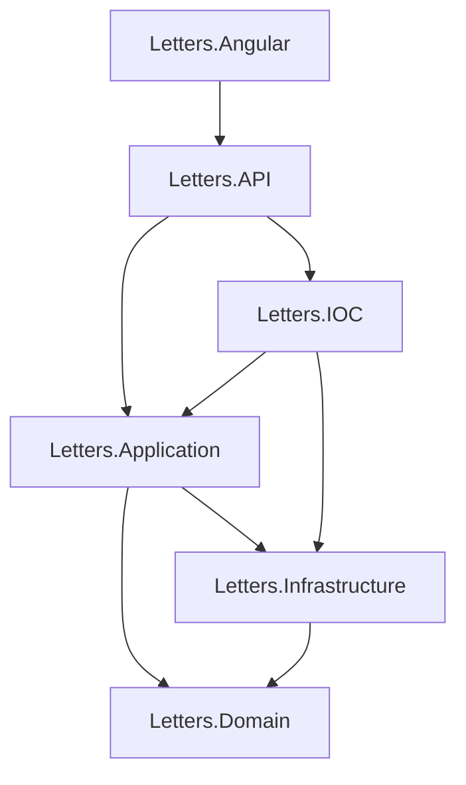

# 📚 Letters - Sistema de Gestão Educacional

<div align="center">


*Sistema moderno para gestão de usuários em ambiente educacional*

</div>

## 🎯 Sobre o Projeto

**Letters** é uma aplicação web full-stack desenvolvida para gerenciamento de usuários em ambiente educacional, permitindo o controle de estudantes e professores de forma eficiente e organizada.

### ✨ Características Principais

- 🏗️ **Arquitetura Limpa** - Implementação de Clean Architecture com separação clara de responsabilidades
- 🔗 **Domain-Driven Design** - Modelagem baseada no domínio do negócio
- 🌐 **API RESTful** - Backend em .NET 8 com endpoints bem estruturados
- 📱 **Frontend Moderno** - Interface desenvolvida em Angular 18
- 🗄️ **Azure SQL Database** - Persistência de dados na nuvem
- 🔄 **Entity Framework Core** - ORM para mapeamento objeto-relacional

## 🏛️ Arquitetura

O projeto segue os princípios de **Clean Architecture** e está organizado em camadas:

```
📁 Letters/
├── 🌐 Letters.API/              # Camada de apresentação (Web API)
├── 🖥️ Letters.Angular/          # Frontend Angular
├── 🎯 Letters.Application/      # Casos de uso e services
├── 🏗️ Letters.Domain/          # Entidades e regras de negócio
├── 🔧 Letters.Infrastructure/   # Acesso a dados e repositórios
└── 🔗 Letters.IOC/             # Injeção de dependência
```

### 📊 Diagrama de Camadas



## 🚀 Tecnologias Utilizadas

### Backend
- **.NET 8.0** - Framework principal
- **ASP.NET Core Web API** - Criação de APIs RESTful
- **Entity Framework Core** - ORM para acesso a dados
- **SQL Server (Azure)** - Banco de dados relacional
- **Dependency Injection** - Inversão de controle

### Frontend
- **Angular 18** - Framework frontend
- **TypeScript** - Linguagem de programação
- **RxJS** - Programação reativa
- **Angular CLI** - Ferramentas de desenvolvimento

### Infraestrutura
- **Azure SQL Database** - Banco de dados na nuvem
- **Visual Studio 2022** - IDE de desenvolvimento

## 📋 Pré-requisitos

- [.NET 8.0 SDK](https://dotnet.microsoft.com/download/dotnet/8.0)
- [Node.js](https://nodejs.org/) (versão 18 ou superior)
- [Angular CLI](https://angular.io/cli) - `npm install -g @angular/cli`
- [SQL Server](https://www.microsoft.com/sql-server/) ou Azure SQL Database
- [Visual Studio 2022](https://visualstudio.microsoft.com/) (recomendado)

## ⚙️ Configuração e Instalação

### 1. Clone o Repositório
```bash
git clone https://github.com/Andre-Quintela/Letters.git
cd Letters
```

### 2. Configuração do Backend

#### Restaurar Pacotes NuGet
```bash
dotnet restore
```

### 3. Configuração do Frontend

#### Instalar Dependências
```bash
cd Letters.Angular
npm install
```

## 🚀 Executando a Aplicação

### Backend (API)
```bash
cd Letters.API
dotnet run
```
A API estará disponível em: `https://localhost:7000`

### Frontend (Angular)
```bash
cd Letters.Angular
npm start
```
A aplicação estará disponível em: `http://localhost:4200`

## 📡 Endpoints da API

### Usuários
- `GET /api/user` - Lista todos os usuários
- `GET /api/user/{id}` - Busca usuário por ID
- `POST /api/user` - Cria novo usuário
- `PUT /api/user/{id}` - Atualiza usuário
- `DELETE /api/user/{id}` - Remove usuário

## 🗄️ Modelo de Dados

### Entidade User
```csharp
public class User
{
    public Guid Id { get; set; }
    public string Name { get; set; }
    public string Email { get; set; }
    public string PasswordHash { get; set; }
    public string Document { get; set; }
    public DateTime BornDate { get; set; }
    public Guid SchoolId { get; set; }
    public int Grade { get; set; }
    public bool isTeacher { get; set; }
}
```

## 🧪 Testes

### Backend
```bash
dotnet test
```

### Frontend
```bash
cd Letters.Angular
npm test
```

## 📦 Build para Produção

### Backend
```bash
dotnet publish -c Release -o ./publish
```

### Frontend
```bash
cd Letters.Angular
ng build --prod
```

## 🤝 Contribuindo

1. Faça um fork do projeto
2. Crie uma branch para sua feature (`git checkout -b feature/AmazingFeature`)
3. Commit suas mudanças (`git commit -m 'Add some AmazingFeature'`)
4. Push para a branch (`git push origin feature/AmazingFeature`)
5. Abra um Pull Request

## 📄 Licença

Este projeto está sob a licença MIT. Veja o arquivo [LICENSE](LICENSE) para mais detalhes.

## 👨‍💻 Autor

**André Quintela**
- GitHub: [@Andre-Quintela](https://github.com/Andre-Quintela)

## 📞 Suporte

Se você encontrar algum problema ou tiver dúvidas, sinta-se à vontade para:
- Abrir uma [issue](https://github.com/Andre-Quintela/Letters/issues)
- Entrar em contato através do GitHub

---

<div align="center">
  Feito com ❤️ por André Quintela
</div>